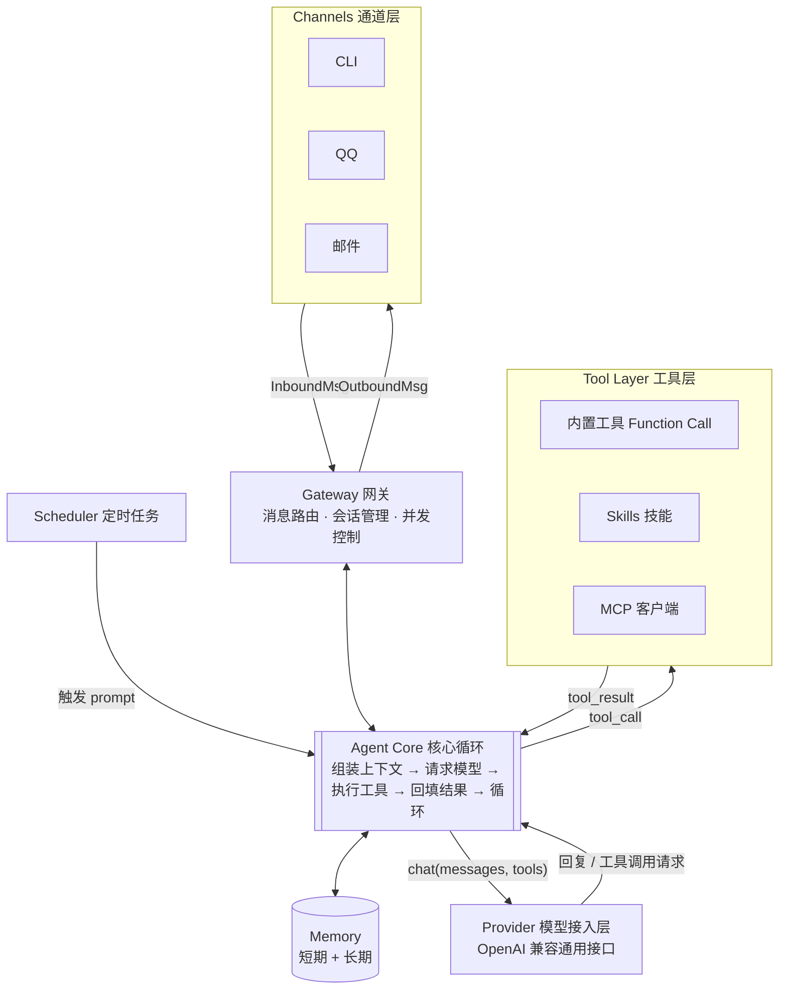

# MiniSpark 项目规划书

> 版本：v0.1（初稿）
> 日期：2026-07-25
> 关联文档：[主流AI-Agent对比总结.md](./主流AI-Agent对比总结.md)

---

## 1. 项目定位

**MiniSpark 是一个基于 Python 的轻量化个人 AI Agent 框架**，目标是用尽量少、尽量可读的代码实现一个"能干活"的完整 Agent：对话、调用工具、执行本地操作、记住东西、按时干活、通过消息平台随时找得到。

### 1.1 对标定位（基于调研结论）

| 参照项目 | 借鉴什么 | 不做什么 |
|---|---|---|
| **nanobot** | 整体定位：~4000 行核心代码的极简 Agent 循环、多通道、MCP、可嵌入 | — |
| **Hermes Agent** | 技能（Skill）设计、分层记忆思路、上下文压缩 | 不做完整的"自我进化学习闭环"（v1 之后再评估） |
| **OpenClaw** | Gateway + Agent + Skills + Memory 的分层架构思想 | 不做 Web UI、浏览器自动化、跨应用协同等重量级功能 |
| **PicoClaw** | 极简哲学：启动快、依赖少、配置一个文件搞定 | 不追求 <10MB 内存（Python 做不到，也不必要） |

一句话：**做一个"带 Skill 系统和长期记忆的 nanobot"**。

### 1.2 量化目标

- 核心代码量：**≤ 6000 行**（不含测试与内置技能）
- 内存占用：**≤ 150MB**（Python 运行时典型值）
- 启动时间：**≤ 3 秒**
- 部署：`pip install minispark` + 一条初始化命令 + 一个配置文件，**5 分钟内跑起来**
- 可嵌入：`from minispark import Agent`，可作为库被其他 Python 项目引用

### 1.3 非目标（Non-Goals）

明确不做的事，防止范围膨胀：

- ❌ Web 控制台 / 图形界面（CLI + 消息平台即全部入口）
- ❌ 浏览器自动化、跨应用协同
- ❌ 多租户 / 多用户权限体系（单用户个人助手）
- ❌ 自研模型推理（全部走 API，兼容本地 Ollama）
- ❌ v1 阶段不做"自动学习创建技能"

---

## 2. 总体架构

**关键修正**：Agent Core 是唯一的中枢，Provider（模型）和 Tool Layer（工具）都只是它调用的两个下游，二者之间没有直接连线——不存在"工具层指向模型接入层"的箭头。一次工具调用的完整链路永远是：Agent Core → Provider（LLM 决定要调用哪个工具）→ Agent Core → Tool Layer（执行）→ Agent Core（回填结果，进入下一轮）。



- **通道层（Channels）**只认识 `InboundMsg`/`OutboundMsg`，不关心 Agent 内部逻辑；
- **Gateway** 负责把各通道的消息路由进 Agent Core，并把结果送回对应通道，多通道并发互不阻塞；
- **Agent Core** 每一轮循环只做两类外呼：问模型"接下来做什么"（Provider），或者"执行模型要求的工具"（Tool Layer）——两者都是单向服务，不会互相调用；
- **Memory** 是 Agent Core 的旁路依赖：读取时注入上下文，写入时来自模型主动调用的记忆工具（记忆工具本身挂在 Tool Layer 下，逻辑上仍然经过 Agent Core 中转）；
- **Scheduler** 只是"定时把一条 prompt 灌给 Agent Core"，不直接碰工具或模型。

**核心设计原则：**

1. **一切扩展能力最终都收敛为"工具"**——内置 Function Call、Skill、MCP 三种来源，在 Agent 核心循环看来是同一个 `Tool` 接口，核心循环不需要知道工具从哪来。
2. **通道与核心解耦**——所有通道适配器只做两件事：把平台消息转成统一的 `InboundMsg`，把 `OutboundMsg` 发回平台。新增一个平台 = 新增一个 ~100 行的适配器文件。
3. **配置驱动**——一个 `config.toml` 控制模型、通道、工具开关，不写代码即可完成日常配置。

---

## 3. 项目框架（目录结构）

```
minispark/
├── pyproject.toml              # 打包与依赖（uv/pip 均可安装）
├── README.md
├── config.example.toml         # 配置模板
│
├── minispark/                  # 主包
│   ├── __init__.py             # 导出 Agent，支持库方式嵌入
│   ├── __main__.py             # python -m minispark 入口
│   ├── cli.py                  # CLI：minispark chat / serve / init / cron
│   ├── config.py               # 配置加载与校验（pydantic）
│   │
│   ├── core/                   # Agent 核心
│   │   ├── agent.py            # Agent 主循环（本项目的心脏，目标 <300 行）
│   │   ├── context.py          # 上下文组装：system prompt + 记忆 + 历史
│   │   ├── session.py          # 会话对象：消息历史、状态
│   │   └── compaction.py       # 上下文压缩（超长对话摘要）
│   │
│   ├── profile/                # Profile 模板（Agent 身份与行为准则）
│   │   └── system_profile.md   # System prompt 模板
│   │
│   ├── providers/              # 模型接入层
│   │   ├── base.py             # Provider 抽象：chat(messages, tools) -> reply
│   │   └── openai_compat.py    # OpenAI 兼容通用接口（覆盖 OpenAI/DeepSeek/Kimi/通义/Ollama 等）
│   │
│   ├── tools/                  # 工具层（Function Call / Skill / MCP）
│   │   ├── base.py             # Tool 抽象：name/description/schema/run()
│   │   ├── registry.py         # 工具注册表
│   │   ├── skill.py            # use_skill 工具（按需加载技能正文）
│   │   ├── function_call/      # Function Call 内置工具
│   │   │   ├── fs.py           # 文件读写、列目录
│   │   │   ├── shell.py        # Shell 执行（带确认/白名单机制）
│   │   │   ├── web.py          # 网页抓取 + 搜索
│   │   │   ├── memory.py       # 记忆读写工具
│   │   │   └── schedule.py     # 让 Agent 自己创建定时任务
│   │   ├── mcp_client.py       # MCP 客户端（连接 MCP Server，映射远端工具）
│   │   └── skills/             # Skill 系统
│   │       ├── loader.py       # 扫描技能目录、解析 SKILL.md
│   │       └── library/        # 随包分发的内置技能库
│   │           ├── daily-briefing/
│   │           └── ...
│   │
│   ├── memory/                 # 记忆系统
│   │   ├── store.py            # SQLite 存储：会话历史 + 长期记忆条目
│   │   └── recall.py           # 记忆检索（关键词 FTS，v2 可选向量）
│   │
│   ├── channels/               # 通道层
│   │   ├── base.py             # Channel 抽象 + InboundMsg/OutboundMsg 定义
│   │   ├── cli.py              # 终端交互通道（开发/调试必备）
│   │   ├── qq.py               # QQ（腾讯官方 Bot API，零额外进程）
│   │   └── email.py            # 邮件（SMTP 发件 + IMAP 收件）
│   │
│   ├── gateway.py              # 网关：多通道并发监听、消息路由到 Agent
│   └── scheduler.py            # 定时任务：cron 表达式 → 触发 Agent 执行 prompt
│
├── tests/                      # pytest 测试
└── docs/                       # 使用文档
```

**代码量预算**（用于控制"轻量"目标）：

| 模块 | 预算行数 |
|---|---|
| core/ | ~800 |
| providers/ | ~300 |
| tools/（Function Call + Skill + MCP） | ~1600 |
| memory/ | ~500 |
| channels/（CLI + QQ + 邮件） | ~1000 |
| gateway + scheduler | ~500 |
| cli + config | ~600 |
| **合计** | **~5500 行** |

---

## 4. 核心功能与实现方式

这是规划书的重点：每个功能**做什么**、**用什么机制实现**（Function Call / Skill / MCP）、**为什么这么选**。

### 4.1 三种扩展机制的分工原则

| 机制 | 适用场景 | 特点 |
|---|---|---|
| **Function Call（内置工具）** | 高频、基础、需要精确控制的原子操作 | 用 Python 直接实现，随包分发，有 JSON Schema，模型原生调用，最快最稳 |
| **Skill（技能）** | 流程性、组合性、可由用户自定义的"工作方法" | 本质是 Markdown 指令 +（可选）脚本，教 Agent"怎么用现有工具完成某类任务"，零代码扩展 |
| **MCP** | 对接外部生态、第三方服务 | 不自己造轮子，直接吃 MCP 生态现成的 Server（GitHub、数据库、地图……） |

判断口诀：**原子能力用 Function Call，工作流程用 Skill，外部生态用 MCP。**

### 4.2 功能清单

#### ① Agent 核心循环 —— 自研（项目心脏）

- **功能**：接收用户消息 → 组装上下文 → 请求 LLM → 若返回工具调用则执行并回填结果 → 循环，直到 LLM 给出最终回复或达到最大轮数（默认 20 轮，可配置；主流框架默认值在 10–25 区间：OpenAI Agents SDK 10、LangChain 15、smolagents 20、LangGraph/CrewAI 25，取 20 居中）。
- **实现**：`core/agent.py`，标准 tool-use loop，基于 asyncio。不引入 LangChain 等重框架——调研中 nanobot 已证明 Agent 循环本身只需几百行，引入框架反而失去"轻量+可读"的核心价值。
- **要点**：
  - 每轮工具调用结果截断（默认单条 ≤ 8K 字符），防止上下文爆炸；
  - 工具并行执行（LLM 一次返回多个 tool_call 时 asyncio.gather）；
  - 异常兜底：工具报错时把错误文本回填给模型让它自行调整，而不是崩溃。

#### ② 模型接入 —— 只做通用接口（OpenAI 兼容）

- **功能**：多模型供应商接入与切换。
- **实现**：`providers/openai_compat.py` **唯一实现**——用 `openai` SDK 指向任意 base_url。OpenAI 兼容协议已是事实标准，这一份代码即覆盖 OpenAI、DeepSeek、Kimi、通义、智谱、vLLM、Ollama 等几乎所有云端与本地端点。切换模型 = 改配置文件两行，不改代码。
- 仍保留 `providers/base.py` 的薄抽象（约 30 行），成本极低，为将来万一需要接入非兼容协议（如 Anthropic 原生 API，已列入 v2 backlog）留好插槽。
- **配置示例**：
  ```toml
  [provider]
  base_url = "https://api.deepseek.com/v1"
  model = "deepseek-chat"
  api_key_env = "DEEPSEEK_API_KEY"
  ```
- **不用 litellm**：它功能全但依赖重，与轻量目标冲突。

#### ③ 内置工具集 —— Function Call 实现

v1 内置 6 组工具，全部走模型原生 function calling：

| 工具 | 说明 | 安全机制 |
|---|---|---|
| `read_file` / `write_file` / `list_dir` | 本地文件管理 | 限制在配置的允许目录内 |
| `run_shell` | Shell 命令执行 | 三级策略：白名单直通 / 默认需确认（CLI 下交互确认，消息平台下回复确认）/ 黑名单拒绝 |
| `web_fetch` | 抓取 URL 转 Markdown | httpx + 简单 HTML 转换 |
| `web_search` | 网络搜索 | 对接可配置的搜索 API（默认 DuckDuckGo 免 key，可换 Tavily/Bing） |
| `memory_save` / `memory_search` | 长期记忆读写 | 见 ⑤ |
| `schedule_task` / `list_tasks` / `cancel_task` | Agent 自己管理定时任务 | 见 ⑥ |

- **实现要点**：`tools/base.py` 定义 `Tool` 基类，用 Python 类型注解 + docstring **自动生成 JSON Schema**（借助 pydantic），写一个新工具只需写一个函数，注册表自动完成 schema 生成与注册。

#### ④ Skill 技能系统 —— Markdown 指令包

- **功能**：让用户不写 Python 代码也能扩展 Agent 的"做事方法"。
- **设计**（参考 Hermes 与 Claude Code 的 Skill 形态）：一个技能 = 一个文件夹：
  ```
  ~/.minispark/skills/weekly-report/
  ├── SKILL.md          # 必需：frontmatter(name/description/触发说明) + 操作指令正文
  └── scripts/          # 可选：技能附带的脚本，指令中可让 Agent 用 run_shell 执行
  ```
- **实现**：`tools/skills/loader.py` 启动时扫描技能目录，把所有技能的 `name + description` 摘要注入 system prompt；同时暴露一个 `use_skill(name)` 内置工具，模型判断任务匹配某技能时调用它，loader 把该技能的 SKILL.md 正文完整加载进上下文，Agent 按指令行事。
- **为什么这样做**：技能正文按需加载（渐进式披露），常驻上下文只有几行摘要，不吃 token；技能本质是 prompt，用户用自然语言就能写，扩展门槛最低。
- **v1 随包内置 2–3 个示例技能**（如"每日简报"、"代码仓库速览"）作为编写范本。

#### ⑤ 记忆系统 —— SQLite + Function Call

- **功能**：短期记忆（会话内历史）+ 长期记忆（跨会话事实）+ 历史对话搜索。
- **实现**：
  - **存储**：单文件 SQLite（`~/.minispark/minispark.db`），两张表：`messages`（全部会话历史）、`memories`（长期记忆条目：内容、标签、时间）。零外部服务依赖。
  - **写入**：主动式（借鉴 Hermes 的核心差异点）——system prompt 指示模型在发现"值得记住的用户偏好/事实/约定"时**主动调用** `memory_save`；用户也可以说"记住……"显式触发。
  - **检索**：SQLite FTS5 全文检索实现 `memory_search`；每轮对话开始时自动取 Top-K 相关记忆注入上下文。**v1 不做向量检索**（避免引入 embedding 依赖），接口预留，v2 可选装。
  - **上下文压缩**：`core/compaction.py`，会话超过 token 阈值时让 LLM 生成摘要替换旧消息，保底长对话不炸。

#### ⑥ 定时任务与主动行为 —— 内置调度器

- **功能**：cron 定时执行 prompt（如"每天 8 点抓新闻发我邮箱"）、任务结果主动推送到指定通道。
- **实现**：`scheduler.py`，用 **APScheduler**（成熟、轻依赖）管理 cron 任务；任务定义持久化到 SQLite，重启不丢。任务触发 = 以任务 prompt 为输入跑一次 Agent，输出通过 Gateway 推送到绑定通道。
- **两种创建方式**：CLI 命令 `minispark cron add`，或对话中直接说"每天早上八点……"——Agent 通过 `schedule_task` 工具自助创建。

#### ⑦ 消息通道 —— 适配器模式

- **功能**：多入口访问同一个 Agent。
- **v1 范围**：**CLI（开发/调试必备）+ QQ + 邮件**。Telegram/飞书/钉钉等列入 v2 backlog。
- **分工**：`minispark/cli.py` 只是 typer 命令入口（薄壳）；终端对话的 REPL 循环、渲染、shell 确认等实现放在 `channels/cli.py`，与其他通道共用 `channels/base.py` 的抽象——M3 Gateway 用同一套接口管理所有入口。
- **QQ 接入方案**：使用**腾讯官方 QQBot API**（[q.qq.com](https://q.qq.com)），纯 HTTP 调用，零额外进程，服务器 0 额外内存占用。
  - 优点：官方合规、稳定可靠、无需运行第三方协议端（NapCat 等），服务器只需跑 MiniSpark 一个进程，1GB 小服务器即可胜任；
  - 鉴权：在 QQ 开放平台创建机器人 → 获取 AppID + AppSecret → 填入配置文件即用；
  - 限制：仅支持机器人账号（非个人号）、只能向互动过的用户主动发消息、群聊需机器人被 @ 才能收到；
  - 配置示例：
    ```toml
    [channels.qq]
    enabled = true
    app_id = "你的AppID"
    secret = "你的AppSecret"
    is_sandbox = false          # 正式环境，true 为沙箱测试
    ```
- **邮件接入方案**：通过 SMTP / IMAP 标准协议收发邮件，零第三方依赖。
  - **SMTP 发件**：Agent 回复内容以邮件形式发送到用户指定邮箱，适合推送日报、周报、定时简报等长文本内容；
  - **IMAP 收件**：轮询收件箱，将新邮件转为 `InboundMsg`，用户可以发邮件给 Agent 下达指令。支持按发件人过滤（白名单模式），防止垃圾邮件干扰；
  - **适用场景**：定时任务结果推送（"每天 8 点把简报发我邮箱"）、离线任务提交（人不在电脑前时发邮件安排任务）、跨设备通知（手机邮箱客户端即可收到 Agent 消息）；
  - **配置示例**：
    ```toml
    [channels.email]
    enabled = true
    smtp_host = "smtp.gmail.com"
    smtp_port = 587
    smtp_username = "your-email@gmail.com"
    smtp_password_env = "EMAIL_APP_PASSWORD"
    imap_host = "imap.gmail.com"
    imap_port = 993
    imap_username = "your-email@gmail.com"
    imap_password_env = "EMAIL_APP_PASSWORD"
    receive_address = "your-email@gmail.com"   # 收件地址
    notify_address = "your-phone@qq.com"       # 通知推送地址（可与收件地址相同）
    poll_interval = 60                          # 收件轮询间隔（秒）
    allowed_senders = ["*@mycompany.com"]       # 允许发指令的邮箱白名单
    ```
- **实现**：`channels/base.py` 定义 `Channel` 抽象（`listen()` 产出 `InboundMsg`，`send(OutboundMsg)`），Gateway 用 asyncio 并发跑所有启用的通道。每个会话按 `channel:chat_id` 维度隔离历史。

#### ⑧ MCP 支持 —— 官方 SDK 客户端

- **功能**：作为 **MCP Client** 连接任意 MCP Server（stdio / Streamable HTTP），把远端工具并入工具注册表。
- **实现**：`tools/mcp_client.py`，基于官方 `mcp` Python SDK。配置文件声明 server，启动时连接并拉取工具列表，包装成统一 `Tool` 对象——对 Agent 核心循环完全透明。
  ```toml
  [[mcp.servers]]
  name = "github"
  command = "npx"
  args = ["-y", "@modelcontextprotocol/server-github"]
  ```
- **v1 只做 Client 不做 Server**；"MiniSpark 自身作为 MCP Server 供其他 Agent 调用"列入 v2。

#### ⑨ CLI 与库嵌入

- **CLI**（基于 typer 或标准 argparse）：
  - `minispark init` —— 交互式向导生成配置（对标 nanobot 的 2 分钟部署）
  - `minispark chat` —— 终端对话
  - `minispark serve` —— 常驻模式（启动 Gateway + Scheduler，接管消息平台）
  - `minispark cron add/list/remove` —— 定时任务管理
- **库嵌入**（对标 Hermes 的 `import AIAgent`）：
  ```python
  from minispark import Agent
  agent = Agent.from_config("config.toml")
  reply = await agent.run("帮我总结这个目录下的代码")
  ```

---

## 5. 技术选型汇总

| 类别 | 选择 | 理由 |
|---|---|---|
| Python 版本 | 3.10+ | asyncio 成熟、性能好；magl 环境为 3.10，TOML 读取用 tomli 兼容（3.11+ 走标准库 tomllib） |
| 并发模型 | asyncio 单进程 | 个人助手负载，无需多进程 |
| 包管理 | uv + pyproject.toml | 现代、快 |
| 配置 | TOML + pydantic v2 | 可读性好，校验强 |
| LLM SDK | openai 官方 SDK（通用兼容接口） | 一份代码覆盖几乎所有供应商 |
| HTTP | httpx | 异步、统一 |
| 存储 | SQLite（标准库 + FTS5） | 零部署、单文件 |
| MCP | 官方 `mcp` SDK | 协议标准实现 |
| 调度 | APScheduler | 成熟轻量 |
| CLI | typer | 开发效率高 |
| 日志 | 标准库 logging + rich | 轻量、终端友好 |
| 测试 | pytest + pytest-asyncio | 事实标准 |

**依赖总数控制在 10 个以内**（不含传递依赖），这是"轻量"的硬指标之一。

---

## 6. 开发路线图

### M0：项目骨架（~3 天）
- pyproject、目录结构、config 加载、日志、CI（ruff + pytest）
- **验收**：`conda activate magl` 后 `pip install -e .` 再 `minispark --help` 可用

### M1：能对话的最小核心（~1 周）⭐ 最关键里程碑
- Provider（openai_compat）+ Agent 核心循环 + CLI chat 通道
- 内置工具：文件读写、shell（带确认）
- **验收**：终端里让它"读某目录代码并总结"，能自主多轮调用工具完成

### M2：记忆 + Skill（~1 周）
- SQLite 会话持久化、长期记忆工具、FTS 检索、上下文压缩
- Skill loader + `use_skill` 工具 + 2 个内置示例技能
- **验收**：跨会话记住用户偏好；能按自定义 SKILL.md 完成流程任务

### M3：通道 + 常驻（~1.5 周）
- Gateway、QQ 通道（腾讯官方 Bot API）、邮件通道（SMTP 发件 + IMAP 收件）、`minispark serve`
- Scheduler 定时任务 + 主动推送
- **验收**：QQ 上与 Agent 对话；"每天 8 点推简报"实际按时触达 QQ/邮箱

### M4：MCP + 打磨 → v1.0 发布（~1 周）
- MCP 客户端、web_search/web_fetch 工具
- **可观测性**：结构化 trace 日志（每轮 tool_call 完整链路、token 用量、耗时统计）
- **工具安全**：文件工具路径沙箱限制（`allowed_dirs` 硬约束，禁止越界访问）
- `minispark init` 向导、文档、示例、发布 PyPI
- **验收**：接入一个社区 MCP Server 并成功调用；新用户照 README 5 分钟跑通

**总计约 5–6 周（业余时间可按 2–2.5 倍估算）。**

### v2 Backlog（发布后按需排期）
- 向量记忆检索（可选装 embedding）
- 更多通道：Telegram、飞书、钉钉、Discord
- Anthropic 原生 API 接入（prompt caching 成本优化）
- MiniSpark 作为 MCP Server 暴露自身能力
- 技能自动创建（Hermes 式学习闭环的最小版本）
- 多会话并发强化
- Docker 镜像 / 一键部署脚本

---

## 7. 关键风险与对策

| 风险 | 影响 | 对策 |
|---|---|---|
| Shell/文件工具的安全性 | 误删文件、执行危险命令 | 目录白名单 + 命令三级策略 + 消息平台上默认只读模式，写操作需逐条确认 |
| 范围膨胀（最大风险） | 做成第二个 OpenClaw，失去轻量定位 | 严守 Non-Goals 清单与 6000 行预算；新功能先进 v2 backlog |
| 不同模型 function calling 质量参差 | 小模型循环卡死、幻觉调用 | 最大轮数熔断；工具报错回填；README 标注推荐模型清单 |
| 上下文成本失控 | 长会话 token 费用高 | 工具结果截断 + 压缩机制 |
| QQ 官方 API 限制 | 仅支持机器人号、不能主动发消息给未互动用户 | 引导用户先给机器人发一条消息建立互动；群聊场景用 @机器人 触发 |
| 消息平台 API 变动 | 通道失效 | 通道层完全隔离，单通道故障不影响核心 |

---

## 8. 与调研四项目的最终能力对照

按调研文档的 7 个维度，MiniSpark v1.0 的目标位：

| 维度 | MiniSpark v1.0 目标 |
|---|---|
| ① 通道接入 | CLI + QQ（腾讯官方 Bot API）+ 邮件（SMTP），QQ 恰好是调研中四个项目覆盖最弱的国内通道，邮件则补齐了跨设备通知和离线任务提交场景 |
| ② 工具执行 | 文件 ✅ / Shell ✅（带安全策略）/ 浏览器自动化 ❌ |
| ③ 记忆与知识 | 短期 ✅ / 长期 ✅ / **主动持久化 ✅**（借鉴 Hermes）/ 历史搜索 ✅ / 上下文压缩 ✅ |
| ④ 技能与扩展 | MCP Client ✅ / 手动 Skill ✅ / 自动学习 ❌(v2) / 库嵌入 ✅ |
| ⑤ 自治调度 | Cron ✅ / 常驻 ✅ / 主动推送 ✅ |
| ⑥ 推理后端 | OpenAI 兼容通用接口一份代码覆盖各家云端 + 本地 Ollama ✅ |
| ⑦ 部署形态 | 自托管 ✅ / pip 安装 / ~150MB 内存 / 3 秒启动 |

即：**通道与工具广度对齐 nanobot，记忆与技能深度看齐 Hermes 的核心项，体量保持在 nanobot 量级。**