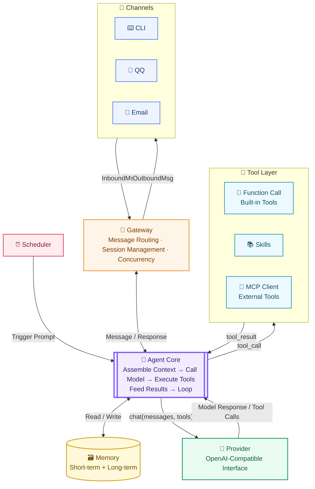
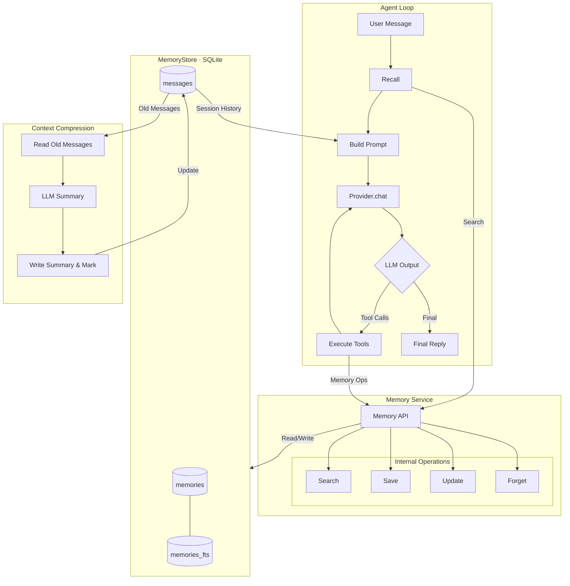
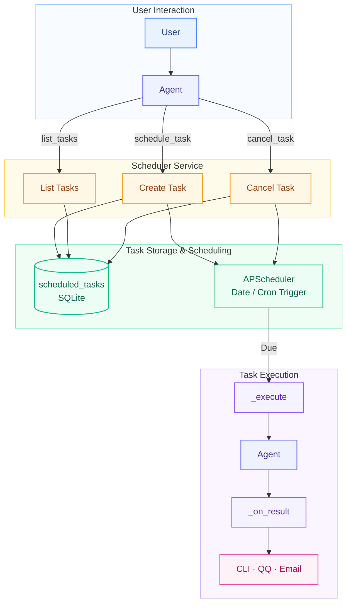

# MiniSpark User Manual

> A lightweight Agent framework designed for low-resource environments, focused on minimal memory footprint, high extensibility, and deep customization.
>
> It runs on servers with just 1GB of RAM. Compared to typical Agent frameworks, it minimizes unnecessary dependencies and runtime overhead while maintaining a clean, flexible modular structure — making it easy to extend model providers, tools, memory systems, message channels, and task scheduling as needed.
>
> Use it as a lightweight, customizable Agent foundation for building personal assistants or automation services — or as a teaching-oriented project for reading, debugging, and understanding how Agents work under the hood.

---

## Table of Contents

- [1. Overview](#1-overview)
- [2. Architecture](#2-architecture)
  - [2.1 Overall Architecture](#21-overall-architecture)
  - [2.2 Project Structure](#22-project-structure)
- [3. Agent Core](#3-agent-core)
  - [3.1 Core Loop](#31-core-loop)
  - [3.2 Assembly](#32-assembly)
    - [3.2.1 System Prompt](#321-system-prompt)
    - [3.2.2 Tools](#322-tools)
  - [3.3 Context Compaction](#33-context-compaction)
- [4. Channel Layer](#4-channel-layer)
  - [4.1 CLI Channel](#41-cli-channel)
  - [4.2 QQ Channel](#42-qq-channel)
  - [4.3 Email Channel](#43-email-channel)
- [5. Tools System](#5-tools-system)
  - [5.1 Three Tool Types](#51-three-tool-types)
  - [5.2 Function Call Tools in Detail](#52-function-call-tools-in-detail)
    - [File Operations (fs.py)](#file-operations-fspy)
    - [Shell Commands (shell.py)](#shell-commands-shellpy)
    - [Web Tools (web.py)](#web-tools-webpy)
    - [Memory Tools (memory.py)](#memory-tools-memorypy)
    - [Schedule Tools (schedule.py)](#schedule-tools-schedulepy)
    - [Email Tools (email.py)](#email-tools-emailpy)
    - [Skill Tools (skill.py)](#skill-tools-skillpy)
  - [5.3 Skills in Detail](#53-skills-in-detail)
  - [5.4 MCP Protocol Tools](#54-mcp-protocol-tools)
- [6. Memory System](#6-memory-system)
  - [6.1 Architecture](#61-architecture)
  - [6.2 Key Design Decisions](#62-key-design-decisions)
  - [6.3 Two Types of Memory](#63-two-types-of-memory)
  - [6.4 Memory Recall](#64-memory-recall)
- [7. Scheduled Tasks](#7-scheduled-tasks)
  - [7.1 Architecture](#71-architecture)
  - [7.2 Two Trigger Modes](#72-two-trigger-modes)
  - [7.3 Usage](#73-usage)
- [8. config.toml Reference](#8-configtoml-reference)
- [9. Quick Start](#9-quick-start)

---

## 1. Overview

**MiniSpark** is a lightweight AI Agent framework designed for **1GB RAM servers**. The core idea: turn LLMs into assistants that actually get things done, not just chat bots. Zero extra processes, pure Python.

---

## 2. Architecture

### 2.1 Overall Architecture



### 2.2 Project Structure

```
minispark/
├── pyproject.toml              # Packaging & dependencies (uv/pip compatible)
├── README.md
├── config.example.toml         # Config template
│
├── minispark/                  # Main package
│   ├── __init__.py             # Exports Agent, supports library embedding
│   ├── __main__.py             # python -m minispark entry point
│   ├── cli.py                  # CLI: minispark chat / serve / init / cron
│   ├── config.py               # Config loading & validation (pydantic)
│   │
│   ├── core/                   # Agent Core
│   │   ├── agent.py            # Agent main loop (the heart, <300 lines target)
│   │   ├── context.py          # Context assembly: system prompt + memory + history
│   │   ├── session.py          # Session object: message history, state
│   │   └── compaction.py       # Context compaction (long conversation summarization)
│   │
│   ├── profile/                # Profile templates (Agent identity & behavior rules)
│   │   └── system_profile.md   # System prompt template
│   │
│   ├── providers/              # Model adapter layer
│   │   ├── base.py             # Provider abstraction: chat(messages, tools) -> reply
│   │   └── openai_compat.py    # OpenAI-compatible interface (covers OpenAI/DeepSeek/Kimi/Qwen/Ollama etc.)
│   │
│   ├── tools/                  # Tool layer (Function Call / Skill / MCP)
│   │   ├── base.py             # Tool abstraction: name/description/schema/run()
│   │   ├── registry.py         # Tool registry
│   │   ├── skill.py            # use_skill tool (load skill body on demand)
│   │   ├── function_call/      # Function Call built-in tools
│   │   │   ├── fs.py           # File read/write, directory listing
│   │   │   ├── shell.py        # Shell execution (with confirmation/allowlist)
│   │   │   ├── web.py          # Web scraping + search
│   │   │   ├── memory.py       # Memory read/write tools
│   │   │   └── schedule.py     # Let Agent create scheduled tasks
│   │   ├── mcp_client.py       # MCP client (connect MCP Server, map remote tools)
│   │   └── skills/             # Skill system
│   │       ├── loader.py       # Scan skill directories, parse SKILL.md
│   │       └── library/        # Built-in skills shipped with package
│   │           ├── daily-briefing/
│   │           └── ...
│   │
│   ├── memory/                 # Memory system
│   │   ├── store.py            # SQLite storage: session history + long-term memory
│   │   └── recall.py           # Memory retrieval (keyword FTS, v2 optional vector)
│   │
│   ├── channels/               # Channel layer
│   │   ├── base.py             # Channel abstraction + InboundMsg/OutboundMsg
│   │   ├── cli.py              # Terminal interaction channel (dev/debug)
│   │   ├── qq.py               # QQ (Tencent official Bot API, zero extra processes)
│   │   └── email.py            # Email (SMTP send + IMAP receive)
│   │
│   ├── gateway.py              # Gateway: multi-channel concurrent listening, routing to Agent
│   └── scheduler.py            # Scheduled tasks: cron → trigger Agent execution
│
├── tests/                      # pytest tests
└── docs/                       # Documentation
```

---

## 3. Agent Core

### 3.1 Core Loop

1. User message arrives → assemble System Prompt (includes skill catalog + relevant memories)
2. Request LLM → if LLM returns "tool calls"
3. Execute all tool calls in parallel → feed results back to LLM
4. Repeat 2-3 until LLM gives a final reply or max turns reached (default 20)

The core loop is the "heart" of MiniSpark, located in the `Agent.run()` method in [agent.py](file:///e:/OneDrive/Project/MiniTools/MiniSpark/minispark/core/agent.py). Every incoming message triggers a full loop.

### 3.2 Assembly

**provider.chat(System Prompt, tools)**

#### 3.2.1 System Prompt

Not a static string — rebuilt dynamically before every request. (context.py)

```
system_profile + memory injection + skill catalog injection + session history
```

**System Profile:** from `profile/system_profile.md`, containing `{model}`, `{os}`, `{now}`, `{language}`, `{allowed_dirs}` and other placeholders. The template defines the Agent's identity ("You are MiniSpark, a lightweight personal AI assistant running on the user's machine"), runtime environment info, and behavioral rules (e.g., "call tools directly to complete tasks, don't just output steps", "reply in Chinese", "proactively call memory_save when discovering important facts").

**Memory Injection:** retrieval count capped by `config.memory.recall_top_k` (default 5). Memories are only injected into the System Prompt — not written to `session.messages`. This ensures relevance (re-retrieved per request) and prevents memory entries from polluting conversation history or being lost during compaction.

**Skills Injection:** skill bodies are loaded on-demand via the `use_skill` tool — this is "Progressive Disclosure", preventing prompt bloat and token waste.

**Session History:** from `session.messages`, containing all user messages, assistant replies, and tool calls/results for the current session. Note: the three layers above are NOT part of session history.

#### 3.2.2 Tools

```
[API-level] tools parameter
```

FC tools + MCP tools' JSON Schema (not in prompt text) are passed directly to the Provider, which forwards them to the LLM API.

### 3.3 Context Compaction

When the LLM returns a "context length exceeded" error, MiniSpark automatically triggers a forced compaction and retries. Manual compaction is also available via the `/compact` command.

Compaction follows these principles:

**Principle 1: Keep N most recent messages, only compact old segments**

Rather than blindly compacting all history, the conversation is split into two segments: the old segment (early messages) and the tail (most recent `keep_recent_messages`, default 8). The old segment is summarized by the LLM; the tail is preserved as-is. This keeps recent conversation details intact for coherent context understanding.

**Principle 2: Split point protects tool_calls pairing**

Messages cannot be arbitrarily split. The OpenAI-compatible API requires that `tool_calls` in an `assistant` message and the subsequent `tool` result messages must appear as a pair. `find_safe_split()` ensures the split point never falls on a `tool` message — it extends the tail backward until it finds an `assistant` message as the starting point.

**Principle 3: Summary focuses on key information, capped at configurable token limit (default 1000 tokens)**

The summary prompt explicitly instructs the LLM to retain only four categories of information: key facts (what the user said), user preferences (likes/dislikes), decisions made and unfinished items, and important file paths, commands, and identifiers.

**Principle 4: Fallback — hard truncation without data loss**

If the summary request fails (LLM timeout, error, etc.), the conversation is not blocked. Instead, old messages are replaced with a marker: `[Note: earlier conversation truncated due to context length. Full history archived.]`. The complete old messages remain in the SQLite database.

**Principle 5: Summary persists, effective across sessions**

Compacted summary messages are written to `messages` and SQLite. This means even after exiting and reopening a session, the summary persists, and the LLM doesn't need to re-read the full history to gain context.

---

## 4. Channel Layer

Channels are the entry points for Agent-user interaction. MiniSpark supports three channels, each independently toggleable in `config.toml`.

### 4.1 CLI Channel

**Start command:** `python -m minispark chat`

The most basic interaction mode — chat with the Agent in the terminal. The CLI channel is always enabled (`channels.cli = true`) and is the most common development and debugging entry point.

**CLI session commands (`/` prefix):**

`/` commands are entered directly in the conversation and handled by the CLI channel directly, bypassing the Agent.

| Command | Description |
|---|---|
| `/new [name]` | Start a new session (long-term memory preserved, history reset) |
| `/sessions` | List all sessions |
| `/load <name>` | Switch to a specific session |
| `/delete <name>` | Delete a session's history |
| `/history [n]` | Show the last n messages of current session (default 10) |
| `/compact` | Force compact current session context (summarize old messages) |
| `/memory` | View all long-term memories |
| `/forget <id>` | Delete a long-term memory by ID (IDs from `/memory`) |
| `/tools_list` | List all registered Function Call tools |
| `/skills_list` | List all discovered skills |
| `/cron_list` | List all scheduled tasks |
| `/cron_cancel <ID>` | Cancel a scheduled task (ID from `/cron_list`) |
| `/model [name]` | Show or switch model: no argument shows current + available list; with argument switches |
| `/help` | Show help |
| `exit` / `quit` | Exit |

**Model switching:** When `/model` is called without arguments, it fetches the available model list in real-time via the `/v1/models` API (result cached, no repeat requests). The current model is marked with `← current`. After switching, the `{model}` placeholder in the System Prompt and the API request's `model` parameter are updated synchronously — no restart needed.

### 4.2 QQ Channel

**Start command:** `python -m minispark qq`

Based on the **Tencent Official Bot API**, using WebSocket for long-lived connections and HTTP API for sending messages.

```toml
[channels.qq]
enabled = true
app_id = "your-app-id"         # QQ Open Platform app ID
secret = "your-app-secret"     # QQ Open Platform app secret
is_sandbox = false             # false=production, true=sandbox testing
```

**Setup:**

1. Go to [QQ Open Platform](https://q.qq.com) and create a bot app
2. Obtain AppID and AppSecret
3. Fill in the config and start

**Limitations:**

- Bot accounts only (not personal accounts)
- Can only proactively message users who have interacted with the bot
- In group chats, the bot must be @mentioned to receive messages

### 4.3 Email Channel

**Start command:** No separate startup needed — the `send_email` tool is auto-mounted in CLI mode.

Based on Gmail SMTP protocol, using app-specific passwords (no OAuth needed), zero third-party dependencies.

**Configuration:**

```toml
[channels.email]
enabled = true
sender = "you@gmail.com"      # Sender Gmail address
password = "app-password"     # Gmail app-specific password
to = ""                       # Default recipient (optional)
```

**Usage:**

In CLI conversations, simply say "send an email to xxx", and the Agent will automatically call the `send_email` tool.

---

## 5. Tools System

### 5.1 Three Tool Types

MiniSpark's tool system uses a **unified registry** design. All tools are registered and managed through `ToolRegistry`, exposing a unified interface (`schemas()` + `execute()`) to the Agent core loop.

| Type | Source | Mechanism | Typical Use |
|---|---|---|---|
| **Function Call (FC)** | Built-in Python functions | Auto-generate JSON Schema, LLM calls directly | File ops, shell, search, memory |
| **Skill** | `SKILL.md` skill files | On-demand prompt instructions, LLM calls `use_skill` first | Hot search scraping, daily briefing |
| **MCP** | External MCP Server | Connect remote tool services via MCP protocol | Extend with third-party tools |

**Tool registration flow:**

```
Each module's create_xxx_tools() → ToolRegistry.register() → Agent uses
```

Each channel selectively registers tools at startup based on configuration. For example, the CLI channel registers QQ tools if QQ is enabled, ensuring `send_qq_message` is available in CLI mode.

### 5.2 Function Call Tools in Detail

FC tools are **built-in Python functions** wrapped with `FunctionTool` to auto-generate OpenAI-compatible JSON Schema. The LLM decides when to call and what parameters to pass based on the Schema. There are currently **17 FC tools** across 7 modules:

| # | Module | Tool | Function |
|---|--------|------|----------|
| 1 | `fs.py` | `read_file` | Read a text file (utf-8) |
| 2 | | `write_file` | Write content to a file (overwrite) |
| 3 | | `append_file` | Append content to end of file |
| 4 | | `edit_file` | Precisely replace a text segment in file |
| 5 | | `list_dir` | List directory contents |
| 6 | `shell.py` | `run_shell` | Execute a shell command |
| 7 | `web.py` | `web_search` | Web search (DuckDuckGo) |
| 8 | | `web_fetch` | Web page fetch (HTML → plain text) |
| 9 | `memory.py` | `memory_save` | Save a long-term memory entry |
| 10 | | `memory_search` | Search long-term memories |
| 11 | | `memory_update` | Update an existing memory |
| 12 | | `memory_forget` | Delete a memory entry |
| 13 | `schedule.py` | `schedule_task` | Create a scheduled task |
| 14 | | `list_tasks` | List all scheduled tasks |
| 15 | | `cancel_task` | Cancel a scheduled task |
| 16 | `email.py` | `send_email` | Send an email |
| 17 | `skill.py` | `use_skill` | Load full instructions for a skill |

#### File Operations (fs.py)

| Tool | Function | Parameters |
|---|---|---|
| `read_file` | Read a text file (utf-8) | `path`: file path |
| `write_file` | Write content to file (overwrite) | `path`: file path, `content`: content |
| `append_file` | Append content to end of file, auto-create parent dirs and file | `path`: file path, `content`: content to append |
| `edit_file` | Precisely replace a text segment (first match wins) | `path`: file path, `old_string`: original text, `new_string`: replacement |
| `list_dir` | List directory contents | `path`: directory path (defaults to current dir) |

**Security:** All paths must fall within the `tools.allowed_dirs` allowlist in `config.toml`, or access is denied. `append_file` only appends (never overwrites). `edit_file` requires exact match of the original text (multiple matches trigger an error prompting "provide more context to make it unique"), preventing accidental edits.

#### Shell Commands (shell.py)

| Tool | Function |
|---|---|
| `run_shell` | Execute a shell command |

**Three-tier security:**

1. **Blocklist** (direct reject): `rm -rf /`, `shutdown`, `diskpart`, and 30+ high-risk patterns
2. **Allowlist** (direct allow): `ls`, `cat`, `git status`, `pip list`, and other read-only commands
3. **Gray list** (human confirmation): all other commands trigger a `[y/n]` prompt in CLI

Extend via `config.toml`:

```toml
[tools]
shell_whitelist = ["npm test", "python -m pytest"]
shell_blacklist = ["docker rm"]
shell_require_confirm = true
shell_timeout = 60
```

#### Web Tools (web.py)

| Tool | Function | Notes |
|---|---|---|
| `web_search` | Web search | DuckDuckGo, no API key needed, returns top 5 results |
| `web_fetch` | Web page fetch | HTML auto-converted to plain text, links to Markdown, JSON API support |

#### Memory Tools (memory.py)

| Tool | Function | Parameters |
|---|---|---|
| `memory_save` | Save a long-term memory entry | `content`: content, `tags`: tags (comma-separated) |
| `memory_search` | Search long-term memories | `query`: keywords, `limit`: max results |
| `memory_update` | Update an existing memory | `old_content`: fragment to locate, `new_content`: new content |
| `memory_forget` | Delete a memory | `query`: keyword to locate |

**Design philosophy:** Proactive persistence (Hermes-inspired). The System Prompt guides the model to proactively call `memory_save` when discovering user preferences, facts, or conventions worth remembering, rather than passively recording everything.

#### Schedule Tools (schedule.py)

| Tool | Function | Parameters |
|---|---|---|
| `schedule_task` | Create a scheduled task | `name`: name, `run_at`: ISO time (one-shot), `cron_expression`: cron (recurring), `prompt`: prompt to execute, `channel`: result push channel |
| `list_tasks` | List all scheduled tasks | None |
| `cancel_task` | Cancel a scheduled task | `task_id`: task ID |

**Typical usage:**

In CLI: "Push stock headlines to my QQ every morning at 8 AM." The Agent will:
1. Call `use_skill("ths-news-hot")` to load the skill
2. Call `schedule_task` to create a `0 8 * * *` cron task
3. Auto-execute scraping and push via QQ when triggered

#### Email Tools (email.py)

| Tool | Function | Parameters |
|---|---|---|
| `send_email` | Send an email | `to`: recipient, `subject`: subject, `body`: body |

Requires Gmail app-specific password configured in `config.toml`.

#### Skill Tools (skill.py)

| Tool | Function | Parameters |
|---|---|---|
| `use_skill` | Load full instructions for a skill | `name`: skill name |

Not a standalone business tool, but the entry point for **progressive disclosure**: skill bodies are not in the resident context; they are loaded on-demand when the LLM determines a task matches a skill, saving tokens.

### 5.3 Skills in Detail

**Skill = Pre-defined workflow prompt**

Each skill is a folder containing a `SKILL.md` (YAML frontmatter + Markdown instruction body):

```
library/
├── daily-briefing/SKILL.md    # Daily briefing
├── weibo-hot/SKILL.md          # Weibo hot search
├── bilibili-hot/SKILL.md       # Bilibili hot search
├── douyin-hot/SKILL.md         # Douyin hot search
├── ths-news-hot/SKILL.md       # THS financial news
└── futu-news-hot/SKILL.md      # Futu financial news
```

**Progressive disclosure mechanism:**

1. Resident context: only `name + description` one-line summary
2. LLM determines task matches a skill → calls `use_skill("skill-name")`
3. Full `SKILL.md` body injected into context
4. LLM executes step-by-step per the instructions

**Example — THS headline skill:**

```markdown
---
name: ths-news-hot
description: Fetch THS hot news and format for push.
triggers:
  - "stock news"
  - "financial news"
---

# THS Hot News

1. Use web_fetch to scrape https://news.10jqka.com.cn/
2. Extract top 10 news titles and links
3. Format as Markdown output
```

**Adding a custom Skill:**

Create a new folder under `library/`, create a `SKILL.md` with the same format (frontmatter: name + description, then instruction body). No restart needed.

### 5.4 MCP Protocol Tools

MCP (Model Context Protocol) allows MiniSpark to connect to external tool services.

**Configuration example:**

```toml
[[mcp.servers]]
name = "filesystem"
command = "npx"
args = ["-y", "@anthropic/mcp-filesystem", "/path/to/allowed/dir"]
```

Once configured, tools provided by the MCP Server are auto-registered in `ToolRegistry` and scheduled alongside built-in FC tools.

---

## 6. Memory System

### 6.1 Architecture



### 6.2 Key Design Decisions

| Design | Description |
|---|---|
| **Dual-table separation** | `messages` stores session history (compactable), `memories` stores long-term memory (cross-session). No interference. |
| **FTS5 trigram** | Chinese-friendly tokenization. 3+ character substrings use full-text index; short queries fall back to LIKE. Works without FTS5 too. |
| **Duplicate prevention** | `memory_save` checks for exact duplicates before writing, preventing the Agent from repeatedly saving the same fact. |
| **Memory only in System Prompt** | Retrieval results are injected into the prompt but not written to `session.messages`. No memory loss during compaction. |
| **Compaction without deletion** | The `compacted` field marks entries; full history is always preserved in SQLite. |
| **Proactive persistence** | Hermes-inspired: the model proactively calls `memory_save` when it determines something is "worth remembering", rather than passively recording all conversations. |

### 6.3 Two Types of Memory

| Type | Stored Content | Management |
|---|---|---|
| **Session History** | Complete messages per turn | Auto-saved; auto-compacted when context is too long (summary replaces old messages) |
| **Long-term Memory** | User preferences, facts, conventions | Model proactively calls `memory_save` to save, `memory_search` to retrieve |

### 6.4 Memory Recall

Before each conversation turn, relevant memories are recalled from long-term memory (up to `recall_top_k` entries, default 5) and injected into the "Relevant Memories" section of the System Prompt.

**Configuration:**

```toml
[memory]
db_path = "minispark/memory/minispark.db"  # SQLite path
recall_top_k = 5                           # Memory entries per turn
compact_token_threshold = 128000           # Token threshold to trigger compaction
keep_recent_messages = 8                   # Recent messages to keep during compaction
```

---

## 7. Scheduled Tasks

### 7.1 Architecture



### 7.2 Two Trigger Modes

| Mode | Parameter | Example |
|---|---|---|
| **One-shot** | `run_at`: ISO time | `"2025-08-01T08:00:00"` |
| **Recurring** | `cron_expression`: cron expression | `"0 8 * * *"` (daily at 8 AM) |

### 7.3 Usage

**Method 1: Create in conversation** (recommended)

```
User: Push stock headlines to me every morning at 8 AM
Agent: Got it, creating scheduled task
  → use_skill("ths-news-hot")
  → schedule_task(name="Morning Stock Report", cron_expression="0 8 * * *", prompt="Fetch stock headlines and push", channel="qq")
```

**Method 2: Command-line management**

```bash
python -m minispark schedule list    # List all tasks
python -m minispark schedule add     # Add a task
python -m minispark schedule remove  # Remove a task
```

---

## 8. config.toml Reference

### Full Configuration Example

```toml
# ── Model Provider ──
[provider]
base_url = "https://api.deepseek.com/v1"   # OpenAI-compatible endpoint
model = "deepseek-chat"                    # Model name
api_key = "sk-xxxxxxxxxxxxxxxx"            # API Key

# ── Agent Core ──
[agent]
max_turns = 20                             # Max tool call turns
result_char_limit = 10000                  # Tool result truncation chars
language = "Simplified Chinese"            # Reply language

# ── Memory System ──
[memory]
db_path = "minispark/memory/minispark.db"  # Database path
recall_top_k = 5                           # Memory entries recalled per turn
compact_token_threshold = 128000           # Token threshold to trigger compaction
keep_recent_messages = 8                   # Recent messages kept during compaction

# ── Tool Security ──
[tools]
allowed_dirs = ["."]                       # Allowed directories for file tools
shell_whitelist = []                       # Additional allowlist commands
shell_blacklist = []                       # Additional blocklist commands
shell_require_confirm = true               # Non-allowlist commands require confirmation
shell_timeout = 60                         # Command timeout in seconds

# ── Channel Toggles ──
[channels]
cli = true                                 # CLI channel

[channels.qq]
enabled = false                            # QQ channel
app_id = ""
secret = ""
is_sandbox = false

[channels.email]
enabled = false                            # Email channel
sender = ""
password = ""
to = ""

# ── Scheduler ──
[scheduler]
enabled = false                            # Scheduler toggle
db_path = ""                               # Task database path (empty = reuse memory db)

# ── MCP Servers ──
[[mcp.servers]]
name = "filesystem"
command = "npx"
args = ["-y", "@anthropic/mcp-filesystem", "/path/to/dir"]
```

---

## 9. Quick Start

### Requirements

- Python 3.11+
- 1GB RAM (minimum)
- Dependencies: `pip install -e .`

### Step 1: Install

```bash
cd MiniSpark
pip install -e .
```

### Step 2: Configure

Edit `config.toml`, fill in your API Key:

```toml
[provider]
api_key = "sk-your-api-key"
model = "deepseek-chat"
```

### Step 3: Start CLI

```bash
python -m minispark chat
```

Now you can chat with the Agent:

```
You: Search for today's tech news
Agent: [calls web_search] → returns formatted results
```

### Step 4: Enable QQ Bot (Optional)

1. Create a bot on [QQ Open Platform](https://q.qq.com)
2. Get AppID and AppSecret
3. Edit `config.toml`:

```toml
[channels.qq]
enabled = true
app_id = "your-app-id"
secret = "your-app-secret"
is_sandbox = true    # Test in sandbox first
```

4. Start:

```bash
python -m minispark qq
```

### Step 5: Enable Email (Optional)

1. Generate an app-specific password in your Google account
2. Edit `config.toml`:

```toml
[channels.email]
enabled = true
sender = "you@gmail.com"
password = "app-password"
```

3. In CLI conversations, say "send an email to xxx"

### Step 6: Create Scheduled Tasks

```bash
# Start the scheduler
python -m minispark serve

# Or create in CLI conversation
python -m minispark chat
# > Push stock headlines to QQ every morning at 8 AM
```