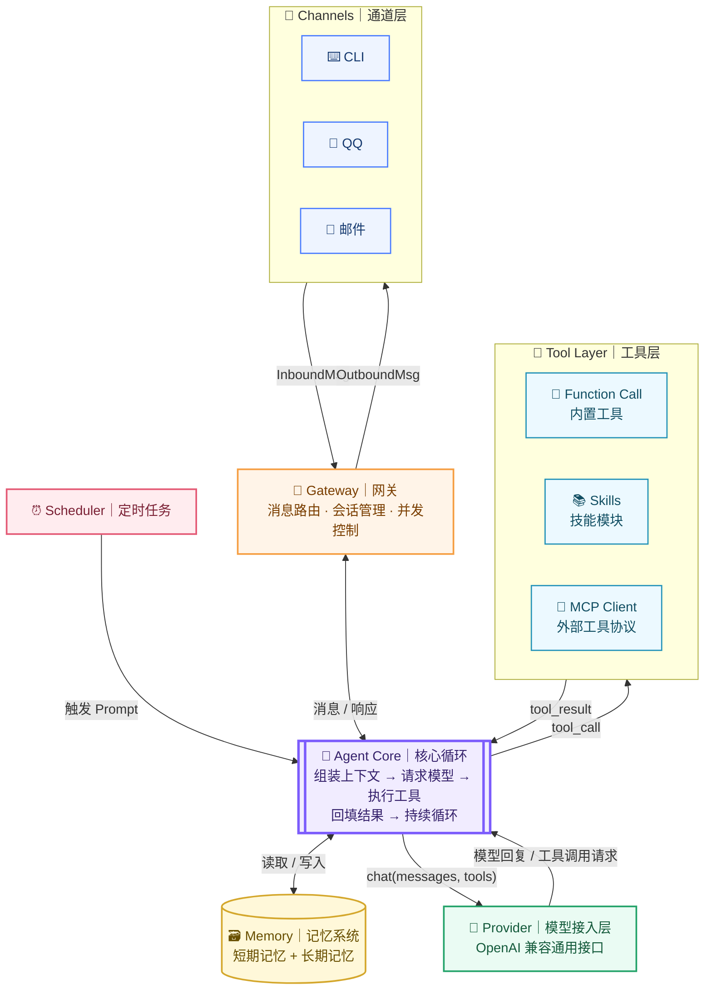
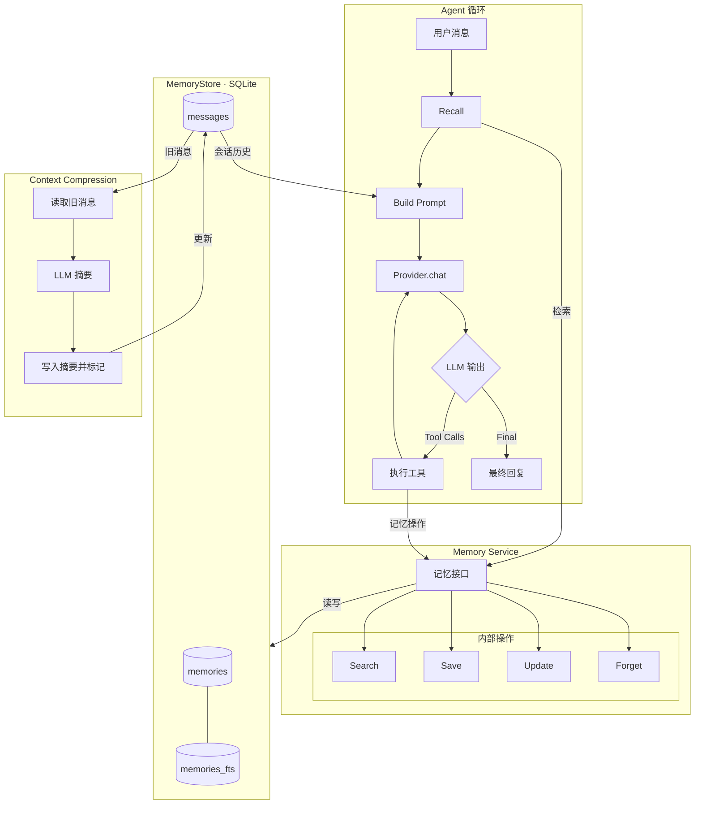
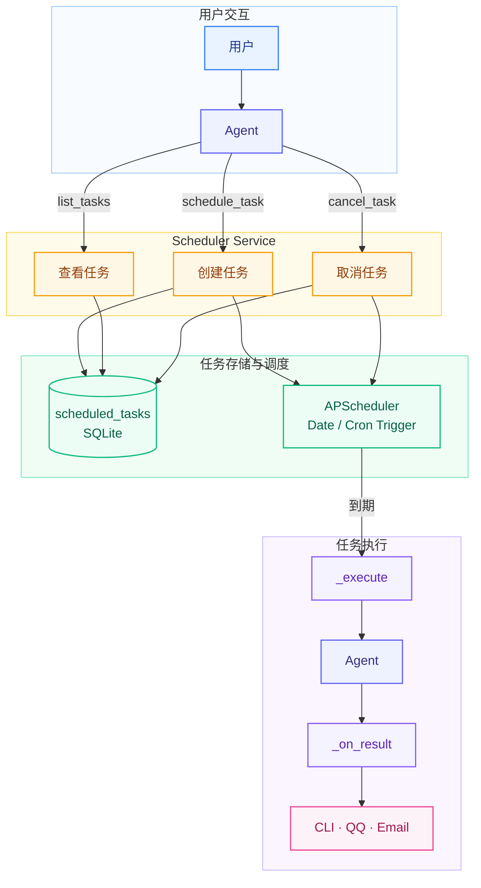

# MiniSpark 用户手册

> 这是一个面向低资源环境设计的轻量级 Agent 框架，专注于低内存占用、高可扩展性与深度定制能力。
>
> 项目可在仅有 1GB 内存的服务器上运行。相比常见的 Agent 框架，它尽量减少不必要的依赖与运行开销，同时保留清晰、灵活的模块化结构，便于开发者根据实际需求扩展模型供应商、工具、记忆系统、消息通道和任务调度等功能。
>
> 你既可以将它作为一个轻量、可定制的 Agent 基础框架，用于构建个人助手或自动化服务；也可以将它视为一个便于阅读、调试和学习 Agent 工作原理的教学型项目。

---

## 目录

- [一、项目简介](#一项目简介)
- [二、项目框架](#二项目框架)
  - [2.1 总体架构](#21-总体架构)
  - [2.2 项目目录](#22-项目目录)
- [三、Agent 核心](#三agent核心)
  - [3.1 核心循环](#31-核心循环agent-类)
  - [3.2 组装](#32-组装)
    - [3.2.1 System Prompt](#321-system-prompt)
    - [3.2.2 Tools](#322-tools)
  - [3.3 上下文压缩](#33-上下文压缩)
- [四、Channel 层](#四channel-层)
  - [4.1 CLI 通道](#41-cli-通道)
  - [4.2 QQ 通道](#42-qq-通道)
  - [4.3 邮件通道](#43-邮件通道)
- [五、Tools 工具系统](#五tools-工具系统)
  - [5.1 三种工具类型](#51-三种工具类型)
  - [5.2 Function Call 工具详解](#52-function-call-工具详解)
    - [文件操作（fs.py）](#文件操作fspy)
    - [Shell 命令（shell.py）](#shell-命令shellpy)
    - [网络工具（web.py）](#网络工具webpy)
    - [记忆工具（memory.py）](#记忆工具memorypy)
    - [定时任务工具（schedule.py）](#定时任务工具schedulepy)
    - [邮件工具（email.py）](#邮件工具emailpy)
    - [技能工具（skill.py）](#技能工具skillpy)
  - [5.3 Skill 技能详解](#53-skill-技能详解)
  - [5.4 MCP 协议工具](#54-mcp-协议工具)
- [六、记忆系统](#六记忆系统)
  - [6.1 架构](#61-架构)
  - [6.2 关键设计](#62-关键设计)
  - [6.3 两种记忆](#63-两种记忆)
  - [6.4 记忆召回](#64-记忆召回)
- [七、定时任务](#七定时任务)
  - [7.1 架构](#71-架构)
  - [7.2 两种触发模式](#72-两种触发模式)
  - [7.3 使用方式](#73-使用方式)
- [八、config.toml 配置详解](#八configtoml-配置详解)
- [九、快速开始](#九快速开始)

---

## 一、项目简介

**MiniSpark** 是一个轻量级 AI Agent 框架，专为 **1GB 内存服务器** 设计。核心思路是：让 LLM 变成一个能真正干活的小助手，而不是只能聊天。零额外进程，纯 Python 实现

---

## 二、项目框架

### 2.1 总体架构



### 2.2 项目目录

```
minispark/
├── pyproject.toml              # 打包与依赖（uv/pip 均可安装）
├── README.md
├── config.example.toml         # 配置模板
│
├── minispark/                  # 主包
│   ├── __init__.py             # 导出 Agent，支持库方式嵌入
│   ├── __main__.py             # python -m minispark 入口
│   ├── cli.py                  # CLI：minispark chat / serve / init / cron
│   ├── config.py               # 配置加载与校验（pydantic）
│   │
│   ├── core/                   # Agent 核心
│   │   ├── agent.py            # Agent 主循环（本项目的心脏，目标 <300 行）
│   │   ├── context.py          # 上下文组装：system prompt + 记忆 + 历史
│   │   ├── session.py          # 会话对象：消息历史、状态
│   │   └── compaction.py       # 上下文压缩（超长对话摘要）
│   │
│   ├── profile/                # Profile 模板（Agent 身份与行为准则）
│   │   └── system_profile.md   # System prompt 模板
│   │
│   ├── providers/              # 模型接入层
│   │   ├── base.py             # Provider 抽象：chat(messages, tools) -> reply
│   │   └── openai_compat.py    # OpenAI 兼容通用接口（覆盖 OpenAI/DeepSeek/Kimi/通义/Ollama 等）
│   │
│   ├── tools/                  # 工具层（Function Call / Skill / MCP）
│   │   ├── base.py             # Tool 抽象：name/description/schema/run()
│   │   ├── registry.py         # 工具注册表
│   │   ├── skill.py            # use_skill 工具（按需加载技能正文）
│   │   ├── function_call/      # Function Call 内置工具
│   │   │   ├── fs.py           # 文件读写、列目录
│   │   │   ├── shell.py        # Shell 执行（带确认/白名单机制）
│   │   │   ├── web.py          # 网页抓取 + 搜索
│   │   │   ├── memory.py       # 记忆读写工具
│   │   │   └── schedule.py     # 让 Agent 自己创建定时任务
│   │   ├── mcp_client.py       # MCP 客户端（连接 MCP Server，映射远端工具）
│   │   └── skills/             # Skill 系统
│   │       ├── loader.py       # 扫描技能目录、解析 SKILL.md
│   │       └── library/        # 随包分发的内置技能库
│   │           ├── daily-briefing/
│   │           └── ...
│   │
│   ├── memory/                 # 记忆系统
│   │   ├── store.py            # SQLite 存储：会话历史 + 长期记忆条目
│   │   └── recall.py           # 记忆检索（关键词 FTS，v2 可选向量）
│   │
│   ├── channels/               # 通道层
│   │   ├── base.py             # Channel 抽象 + InboundMsg/OutboundMsg 定义
│   │   ├── cli.py              # 终端交互通道（开发/调试必备）
│   │   ├── qq.py               # QQ（腾讯官方 Bot API，零额外进程）
│   │   └── email.py            # 邮件（SMTP 发件 + IMAP 收件）
│   │
│   ├── gateway.py              # 网关：多通道并发监听、消息路由到 Agent
│   └── scheduler.py            # 定时任务：cron 表达式 → 触发 Agent 执行 prompt
│
├── tests/                      # pytest 测试
└── docs/                       # 使用文档
```

---

## 三、Agent核心

### 3.1 核心循环（`Agent` 类）：

1. 用户消息进入 → 拼装 System Prompt（含技能目录 + 相关记忆）
2. 请求 LLM → 如果 LLM 返回"工具调用"
3. 并行执行所有工具调用 → 结果回填给 LLM
4. 重复 2-3，直到 LLM 给出最终回复或达到最大轮数（默认 20）

核心循环是 MiniSpark 的"心脏"，位于 [agent.py](file:///e:/OneDrive/Project/MiniTools/MiniSpark/minispark/core/agent.py) 的 `Agent.run()` 方法中。每收到一条消息，就启动一轮完整循环。

### 3.2 组装

**provider.chat(System Prompt, tools)**

#### 3.2.1 System Prompt 

不是静态字符串，而是**每次请求前动态构建**的。（context.py ）

```
system_profile + 长期记忆注入 + 技能目录注入 + 会话历史
```

**system profile：**来自 `profile/system_profile.md`，其中包含 `{model}`、`{os}`、`{now}`、`{language}`、`{allowed_dirs}` 等占位符。模板内容定义了 Agent 的身份（"你是 MiniSpark，运行在用户本机的轻量化个人 AI 助手"）、运行环境信息和 行为准则（如"直接调用工具完成，不要只输出步骤"、"用中文回答"、"发现重要事实时主动调用 memory_save"等）。

**长期记忆注入：**检索条数上限由 `config.memory.recall_top_k` 控制（默认 5 条）。记忆只注入到 System Prompt，这样每次请求时根据当前消息重新检索，保证相关性；同时不会让记忆条目污染对话历史，压缩上下文时也不会丢失记忆。

**Skills注入：**正文由 `use_skill` 工具调用时按需加载——这就是"渐进式披露"（Progressive Disclosure），避免 prompt 过长导致 token 浪费。

**会话历史：**来自 `session.messages`，包含当前会话的所有用户消息、assistant 回复和工具调用/结果。注意：会话历史中不包含上述三层内容

### 3.2.2 tools

```
【API 层面】tools 参数
```

FC 工具 + MCP 工具的 JSON Schema（不进 prompt 文本）直接传给 Provider，Provider 再发给 LLM API

### 3.3 上下文压缩

当 LLM 返回"上下文超长"错误时（如 `context length exceeded`），MiniSpark 会自动触发一次强制压缩，然后重试。也可通过 `/compact` 命令手动压缩。

压缩遵循以下原则：

**原则一：保留最近 N 条，只压缩旧切片**

不是无差别压缩全部历史，而是把会话消息切成两段：旧切片（早期消息）和尾部（最近 `keep_recent_messages` 条，默认 8 条）。旧切片交给 LLM 生成摘要，尾部原样保留。这样最近对话的细节不会丢失，LLM 能继续连贯地理解当前上下文。

**原则二：切分点保护 tool_calls 配对**

压缩时不能随意切断消息。OpenAI 兼容 API 要求：`assistant` 消息中的 `tool_calls` 与其后面的 `tool` 结果消息必须成对出现。如果切分点落在 `tool` 消息上，会切断这对绑定关系，导致 400 错误。

**原则三：摘要聚焦关键信息，不超过 一定字数（默认300 字）**

摘要请求用的 prompt 明确要求 LLM 只保留四类信息：关键事实（用户说了什么重要信息）、用户偏好（用户喜欢/不喜欢什么）、已做出的决定和未完成的事项、重要的文件路径、命令与标识符。摘要严格限制字数，不让压缩后的摘要本身又成为新的 token 负担。

**原则四：兜底机制——硬截断不丢数据**

如果摘要请求失败（LLM 超时、报错等），不阻塞对话，而是硬截断：旧消息被替换为一条标记 `[注：更早的对话因上下文过长已截断，完整历史已归档]`。完整的旧消息仍在 SQLite 数据库中，不会丢失。

**原则五：摘要入库，跨会话生效**

压缩后的摘要消息会写入 `messages` 和 SQLite 归档。这意味着即使退出重开会话，摘要依然存在，LLM 不需要重新读一遍完整历史就能获得上下文背景。


---

## 四、Channel 层

Channel（通道）是 Agent 与用户交互的入口。MiniSpark 支持三种通道，可在 `config.toml` 中独立开关。

### 4.1 CLI 通道

**启动命令：** `python -m minispark chat`

最基础的交互方式，在终端中与 Agent 对话。CLI 通道始终启用（`channels.cli = true`），是最常用的开发和调试入口。


**CLI 会话命令（`/` 开头）：**

`/` 命令在对话中直接输入，不经过 Agent，由 CLI 通道直接处理。

| 命令 | 说明 |
|---|---|
| `/new [名称]` | 开新会话（长期记忆保留，历史清零） |
| `/sessions` | 列出所有会话 |
| `/load <名称>` | 切换到指定会话 |
| `/delete <名称>` | 删除指定会话的历史 |
| `/history [n]` | 查看当前会话最近 n 条消息（默认 10） |
| `/compact` | 强制压缩当前会话上下文（旧消息摘要化） |
| `/memory` | 查看所有长期记忆 |
| `/forget <编号>` | 删除指定编号的长期记忆（编号用 `/memory` 查看） |
| `/tools_list` | 列出所有已注册的 Function Call 工具 |
| `/skills_list` | 列出所有已发现的技能 |
| `/cron_list` | 查看所有定时任务 |
| `/cron_cancel <ID>` | 取消指定定时任务（ID 从 `/cron_list` 获取） |
| `/model [名称]` | 查看或切换模型：不传参数显示当前模型+可用列表，传参数切换模型 |
| `/help` | 显示帮助 |
| `exit` / `quit` | 退出 |

**模型切换说明：** `/model` 不带参数时，会通过 `/v1/models` API 实时获取可用模型列表（结果缓存，首次后不再请求），当前使用的模型以 `← 当前` 标记。切换模型后，System Prompt 中的 `{model}` 占位符和 API 请求的 `model` 参数会同步更新，无需重启。

### 4.2 QQ 通道

**启动命令：** `python -m minispark qq`

基于**腾讯官方 Bot API** 实现，通过 WebSocket 长连接接收消息，HTTP API 发送消息。

```toml
[channels.qq]
enabled = true
app_id = "你的AppID"       # QQ 开放平台应用 ID
secret = "你的AppSecret"    # QQ 开放平台 AppSecret
is_sandbox = false          # false=正式环境，true=沙箱测试
```

**准备工作：**

1. 前往 [QQ 开放平台](https://q.qq.com) 创建机器人应用
2. 获取 AppID 和 AppSecret
3. 填入配置，启动即可

**限制说明：**

- 仅支持机器人账号（非个人号）
- 只能向互动过的用户主动发消息
- 群聊需机器人被 @ 才能收到消息

### 4.3 邮件通道

**启动命令：** 无需单独启动，CLI 模式下自动挂载 `send_email` 工具。

基于 Gmail SMTP 协议，使用应用专用密码（无需 OAuth），零第三方依赖。

**配置：**

```toml
[channels.email]
enabled = true
sender = "you@gmail.com"     # 发件人 Gmail 地址
password = "应用专用密码"      # Gmail 应用专用密码
to = ""                       # 默认收件人（可选）
```

**使用方式：**

在 CLI 对话中直接说"帮我发一封邮件给 xxx"，Agent 会自动调用 `send_email` 工具。

---

## 五、Tools 工具系统

### 5.1 三种工具类型

MiniSpark 的工具系统采用**统一注册表**设计，所有工具通过 `ToolRegistry` 注册和管理，对 Agent 核心循环暴露统一接口（`schemas()` + `execute()`）。

| 类型 | 来源 | 机制 | 典型场景 |
|---|---|---|---|
| **Function Call (FC)** | 内置 Python 函数 | 自动生成 JSON Schema，LLM 直接调用 | 文件操作、Shell、搜索、记忆 |
| **Skill** | `SKILL.md` 技能文件 | 按需加载的 prompt 指令，LLM 先 `use_skill` 再执行 | 热搜抓取、每日简报 |
| **MCP** | 外部 MCP Server | 通过 MCP 协议连接远端工具服务 | 扩展第三方工具 |

**工具注册流程：**

```
各模块 create_xxx_tools() → ToolRegistry.register() → Agent 使用
```

每种通道在启动时会根据配置选择性注册工具。例如 CLI 通道会注册 QQ 工具（如果 QQ 配置启用），确保 `send_qq_message` 在 CLI 中也可用。

### 5.2 Function Call 工具详解

FC 工具是**内置 Python 函数**，通过 `FunctionTool` 包装后自动生成 OpenAI 兼容的 JSON Schema，LLM 根据 Schema 决定何时调用、传什么参数。当前共 **17 个 FC 工具**，分布在 7 个模块中：

| # | 模块 | 工具 | 功能 |
|---|------|------|------|
| 1 | `fs.py` | `read_file` | 读取文本文件（utf-8） |
| 2 | | `write_file` | 写入内容到文件（覆盖写） |
| 3 | | `append_file` | 在文件末尾追加内容 |
| 4 | | `edit_file` | 精确替换文件中的一段文本 |
| 5 | | `list_dir` | 列出目录内容 |
| 6 | `shell.py` | `run_shell` | 执行 Shell 命令 |
| 7 | `web.py` | `web_search` | 网络搜索（DuckDuckGo） |
| 8 | | `web_fetch` | 网页抓取（HTML→纯文本） |
| 9 | `memory.py` | `memory_save` | 保存一条长期记忆 |
| 10 | | `memory_search` | 检索长期记忆 |
| 11 | | `memory_update` | 更新已有记忆 |
| 12 | | `memory_forget` | 删除记忆 |
| 13 | `schedule.py` | `schedule_task` | 创建定时任务 |
| 14 | | `list_tasks` | 列出所有定时任务 |
| 15 | | `cancel_task` | 取消定时任务 |
| 16 | `email.py` | `send_email` | 发送邮件 |
| 17 | `skill.py` | `use_skill` | 加载指定技能的完整指令 |

#### 文件操作（fs.py）

| 工具 | 功能 | 参数 |
|---|---|---|
| `read_file` | 读取文本文件（utf-8） | `path`：文件路径 |
| `write_file` | 写入内容到文件（覆盖写） | `path`：文件路径，`content`：内容 |
| `append_file` | 在文件末尾追加内容，自动创建父目录和文件 | `path`：文件路径，`content`：要追加的内容 |
| `edit_file` | 精确替换文件中的一段文本（首次匹配即替换） | `path`：文件路径，`old_string`：原文，`new_string`：替换文本 |
| `list_dir` | 列出目录内容 | `path`：目录路径（默认当前目录） |

**安全机制：** 所有路径必须落在 `config.toml` 的 `tools.allowed_dirs` 白名单目录内，否则拒绝访问。`append_file` 只追加不覆盖，`edit_file` 要求精确匹配原文（多处匹配时报错提示"提供更多上下文使其唯一"），防止误改。

#### Shell 命令（shell.py）

| 工具 | 功能 |
|---|---|
| `run_shell` | 执行 Shell 命令 |

**三级安全策略：**

1. **黑名单**（直接拒绝）：`rm -rf /`、`shutdown`、`diskpart` 等 30+ 高危模式
2. **白名单**（直接放行）：`ls`、`cat`、`git status`、`pip list` 等只读常用命令
3. **灰名单**（人工确认）：其余命令调用时 CLI 弹 `[y/n]` 确认

可通过 `config.toml` 追加黑白名单：

```toml
[tools]
shell_whitelist = ["npm test", "python -m pytest"]
shell_blacklist = ["docker rm"]
shell_require_confirm = true
shell_timeout = 60
```

#### 网络工具（web.py）

| 工具 | 功能 | 说明 |
|---|---|---|
| `web_search` | 网络搜索 | DuckDuckGo 免 key 搜索，返回前 5 条结果 |
| `web_fetch` | 网页抓取 | HTML 自动转纯文本，链接转 Markdown，支持 JSON 接口 |

#### 记忆工具（memory.py）

| 工具 | 功能 | 参数 |
|---|---|---|
| `memory_save` | 保存一条长期记忆 | `content`：内容，`tags`：标签（逗号分隔） |
| `memory_search` | 检索长期记忆 | `query`：关键词，`limit`：最多返回条数 |
| `memory_update` | 更新已有记忆 | `old_content`：定位片段，`new_content`：新内容 |
| `memory_forget` | 删除记忆 | `query`：定位关键词 |

**设计理念：** 主动式持久化（借鉴 Hermes）。System Prompt 指引模型在发现值得记住的用户偏好/事实/约定时主动调用 `memory_save`，而非被动记录。

#### 定时任务工具（schedule.py）

| 工具 | 功能 | 参数 |
|---|---|---|
| `schedule_task` | 创建定时任务 | `name`：名称，`run_at`：ISO 时间（一次性），`cron_expression`：cron 表达式（周期），`prompt`：到期执行的请求，`channel`：结果推送通道 |
| `list_tasks` | 列出所有定时任务 | 无参数 |
| `cancel_task` | 取消定时任务 | `task_id`：任务 ID |

**典型用法：**

在 CLI 中说"每天早上 8 点给我推送同花顺头条到 QQ"，Agent 会：
1. 调用 `use_skill("ths-news-hot")` 加载技能
2. 调用 `schedule_task` 创建 `0 8 * * *` 的定时任务
3. 到期后自动执行抓取并通过 QQ 推送

#### 邮件工具（email.py）

| 工具 | 功能 | 参数 |
|---|---|---|
| `send_email` | 发送邮件 | `to`：收件人，`subject`：主题，`body`：正文 |

需要在 `config.toml` 中配置 Gmail 应用专用密码。

#### 技能工具（skill.py）

| 工具 | 功能 | 参数 |
|---|---|---|
| `use_skill` | 加载指定技能的完整指令 | `name`：技能名 |

不是一个独立的业务工具，而是**渐进式披露**的入口：技能正文不进常驻上下文，只在 LLM 判定任务匹配时按需加载，节省 token。

### 5.3 Skill 技能详解

**Skill = 预设的工作流程 prompt**

每个 Skill 是一个文件夹，内含 `SKILL.md`（YAML frontmatter + Markdown 指令正文）：

```
library/
├── daily-briefing/SKILL.md    # 每日简报
├── weibo-hot/SKILL.md          # 微博热搜
├── bilibili-hot/SKILL.md       # B站热搜
├── douyin-hot/SKILL.md         # 抖音热搜
├── ths-news-hot/SKILL.md       # 同花顺财经新闻
└── futu-news-hot/SKILL.md      # 富途财经新闻
```

**渐进式披露机制：**

1. 常驻上下文：只有 `name + description` 一行摘要
2. LLM 判断任务匹配某技能时，调用 `use_skill("技能名")`
3. 完整 `SKILL.md` 正文注入上下文
4. LLM 按正文指令逐步执行

**示例——同花顺头条技能：**

```markdown
---
name: ths-news-hot
description: 查询同花顺热点新闻并整理推送。
triggers:
  - "同花顺"
  - "财经新闻"
  - "股市新闻"
---

# 同花顺热点新闻

1. 用 web_fetch 抓取 https://news.10jqka.com.cn/
2. 提取前 10 条新闻标题和链接
3. 整理成 Markdown 格式输出
```

**添加自定义 Skill：**

在 `library/` 下新建文件夹，创建 `SKILL.md`，按相同格式写 frontmatter（name + description）和指令正文即可，无需重启。

### 5.4 MCP 协议工具

MCP（Model Context Protocol）允许 MiniSpark 连接到外部工具服务。

**配置示例：**

```toml
[[mcp.servers]]
name = "filesystem"
command = "npx"
args = ["-y", "@anthropic/mcp-filesystem", "/path/to/allowed/dir"]
```

配置后，MCP Server 提供的工具会自动注册到 `ToolRegistry`，与内置 FC 工具统一调度。

---

## 六、记忆系统

### 6.1 架构



### 6.2 关键设计

| 设计 | 说明 |
|---|---|
| **双表分离** | `messages` 存会话历史（可压缩），`memories` 存长期记忆（跨会话），互不干扰 |
| **FTS5 trigram** | 中文分词友好，3 字以上子串走全文索引，短词自动回退 LIKE，无 FTS5 环境也能跑 |
| **重复防护** | `memory_save` 写入前检查完全重复，避免 Agent 反复保存同一事实 |
| **记忆只进 System Prompt** | 检索结果注入 prompt 但不写入 `session.messages`，压缩时不会丢失记忆 |
| **压缩不删除** | `compacted` 字段打标记，完整历史永远保留在 SQLite 中 |
| **主动式持久化** | 借鉴 Hermes 理念：模型主动判断"值得记住"时调用 `memory_save`，而非被动记录所有对话 |

### 6.3 两种记忆

| 类型 | 存储内容 | 管理方式 |
|---|---|---|
| **会话历史** | 每轮对话的完整消息 | 自动保存，上下文过长时自动压缩（摘要替换旧消息） |
| **长期记忆** | 用户偏好、事实、约定 | 模型主动调用 `memory_save` 保存，`memory_search` 检索 |

### 6.4 记忆召回

每轮对话前，从长期记忆中召回与当前消息相关的记忆（`recall_top_k` 条，默认 5 条），注入 System Prompt 的"相关记忆"区。

**配置：**

```toml
[memory]
db_path = "minispark/memory/minispark.db"  # SQLite 路径
recall_top_k = 5                           # 每轮注入记忆条数
compact_token_threshold = 128000           # 触发压缩的 token 阈值
keep_recent_messages = 8                   # 压缩时保留的最近消息数
```

---

## 七、定时任务

### 7.1 架构



### 7.2 两种触发模式

| 模式 | 参数 | 示例 |
|---|---|---|
| **一次性** | `run_at`：ISO 时间 | `"2025-08-01T08:00:00"` |
| **周期** | `cron_expression`：cron 表达式 | `"0 8 * * *"`（每天 8 点） |

### 7.3 使用方式

**方式一：对话中创建**（推荐）

```
用户：每天早上 8 点给我推送同花顺头条
Agent：好的，我来创建定时任务
  → use_skill("ths-news-hot")
  → schedule_task(name="同花顺早报", cron_expression="0 8 * * *", prompt="抓取同花顺头条并推送", channel="qq")
```

**方式二：命令行管理**

```bash
python -m minispark schedule list    # 列出所有任务
python -m minispark schedule add     # 新增任务
python -m minispark schedule remove  # 删除任务
```


---

## 八、config.toml 配置详解

### 完整配置示例

```toml
# ── 模型供应商 ──
[provider]
base_url = "https://api.deepseek.com/v1"   # OpenAI 兼容端点
model = "deepseek-chat"                    # 模型名称
api_key = "sk-xxxxxxxxxxxxxxxx"            # API Key

# ── Agent 核心 ──
[agent]
max_turns = 20                             # 最大工具调用轮数
result_char_limit = 10000                   # 工具结果截断字符数
language = "简体中文"                       # 回复语言

# ── 记忆系统 ──
[memory]
db_path = "minispark/memory/minispark.db"  # 数据库路径
recall_top_k = 5                           # 每轮召回记忆条数
compact_token_threshold = 128000           # 触发压缩的 token 阈值
keep_recent_messages = 8                   # 压缩时保留最近消息数

# ── 工具安全 ──
[tools]
allowed_dirs = ["."]                       # 文件工具允许目录
shell_whitelist = []                       # 追加白名单命令
shell_blacklist = []                       # 追加黑名单命令
shell_require_confirm = true               # 非白名单需确认
shell_timeout = 60                         # 命令超时秒数

# ── 通道开关 ──
[channels]
cli = true                                 # CLI 通道

[channels.qq]
enabled = false                            # QQ 通道
app_id = ""
secret = ""
is_sandbox = false

[channels.email]
enabled = false                            # 邮件通道
sender = ""
password = ""
to = ""

# ── 定时任务 ──
[scheduler]
enabled = false                            # 调度器开关
db_path = ""                               # 任务数据库路径（留空复用记忆库）

# ── MCP 服务器 ──
[[mcp.servers]]
name = "filesystem"
command = "npx"
args = ["-y", "@anthropic/mcp-filesystem", "/path/to/dir"]
```

---

## 九、快速开始

### 环境要求

- Python 3.10+
- 1GB 内存（最低）
- 依赖：`pip install -e .`

### 第一步：安装

```bash
cd MiniSpark
pip install -e .
```

### 第二步：配置

编辑 `config.toml`，填入你的 API Key：

```toml
[provider]
api_key = "sk-你的APIKey"
model = "deepseek-chat"
```

### 第三步：启动 CLI

```bash
python -m minispark chat
```

现在你可以和 Agent 对话了：

```
你：帮我搜一下今天有什么科技新闻
Agent：[调用 web_search] → 整理结果返回
```

### 第四步：启用 QQ 机器人（可选）

1. 在 [QQ 开放平台](https://q.qq.com) 创建机器人
2. 获取 AppID 和 AppSecret
3. 编辑 `config.toml`：

```toml
[channels.qq]
enabled = true
app_id = "你的AppID"
secret = "你的AppSecret"
is_sandbox = true    # 先沙箱测试
```

4. 启动：

```bash
python -m minispark qq
```

### 第五步：启用邮件（可选）

1. 在 Google 账号生成应用专用密码
2. 编辑 `config.toml`：

```toml
[channels.email]
enabled = true
sender = "you@gmail.com"
password = "应用专用密码"
```

3. 在 CLI 对话中直接说"发邮件给 xxx"

### 第六步：创建定时任务

```bash
# 启动调度器
python -m minispark serve

# 或在 CLI 中对话创建
python -m minispark chat
# > 每天早上 8 点推送同花顺头条到 QQ
```